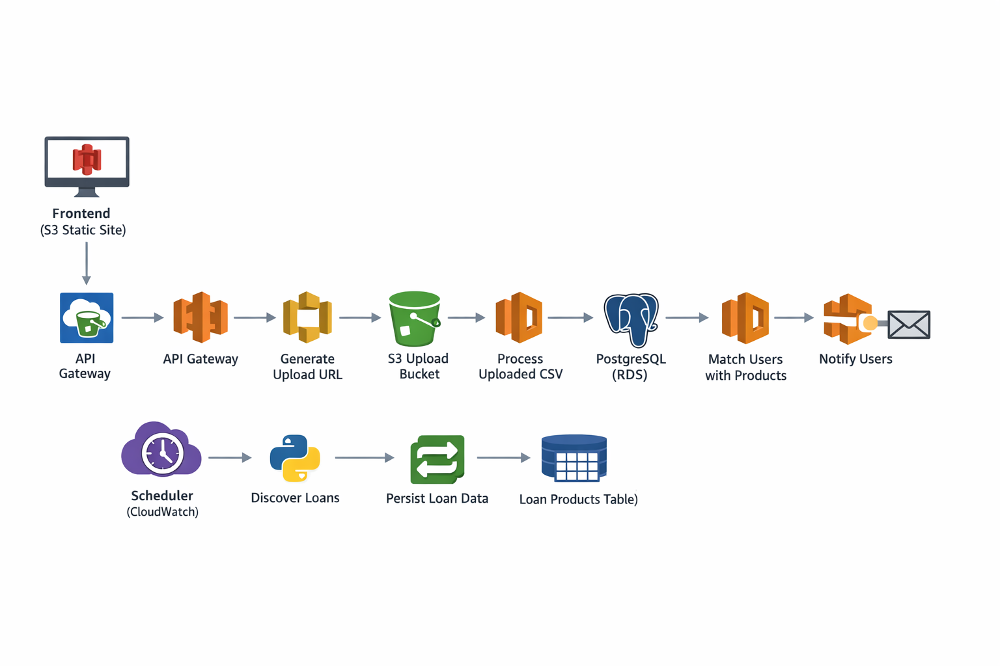

 
 # 📊 Loan Eligibility Engine

A cloud-native serverless platform that ingests user financial data, discovers loan products, and matches eligible users with suitable financial offers.

The system is built using AWS serverless infrastructure and demonstrates event-driven architecture, asynchronous pipelines, and scalable cloud services.

## 🚀 System Overview

The platform automates the process of:

* Ingesting user financial data via CSV uploads

* Discovering loan products from external sources

* Matching users with eligible financial products

* Notifying users via email

This architecture separates data ingestion, product discovery, and user notification into independent pipelines.

## 🏗 Architecture
### User Ingestion Pipeline
```
Frontend (S3 Static Website)
        ↓
API Gateway
        ↓
Generate Upload URL (Lambda)
        ↓
S3 Upload Bucket
        ↓
Process CSV (Lambda)
        ↓
PostgreSQL (RDS)
        ↓
Match Users With Products
        ↓
Notify Users
        ↓
SES Email
```
This pipeline enables secure bulk ingestion of user data through presigned upload URLs.
### Loan Discovery Pipeline
```
CloudWatch Scheduler
        ↓
discoverLoans (Python)
        ↓
persistDiscoveredProducts
        ↓
loan_products table
```
### System Architecture Diagram


## 🧰 Tech Stack

### Cloud Infrastructure
- Amazon Web Services (AWS)

### Core Services
- Amazon S3 – Static website hosting and CSV storage
- Amazon API Gateway – API layer for frontend requests
- AWS Lambda – Serverless compute for ingestion and processing
- Amazon RDS (PostgreSQL) – Relational database for storing users and loan products
- Amazon SES – Email notification service
- Amazon CloudWatch – Scheduling and monitoring

### Languages
- Node.js – Backend services and Lambda functions
- Python – Loan discovery pipeline
- SQL – Database queries and schema management

### Frameworks & Tools
- Serverless Framework – Infrastructure as code and deployment
- Git & GitHub – Version control and project hosting


## 📁 Project Structure
```
loan-eligibility-engine
│
├── backend/
│
├── frontend/ 
│   ├── index.html
│   └── favicon.png
│
├── docs/ 
│
├── sample-data/ 
│   └── users.csv
│
├── .env.example
├── event_hdfc.json 
├── event_icici.json
│
└── README.md # Project documentation
```
## 🧠 Design Principles

- **Serverless-first architecture** for scalability and reduced operational overhead
- **Event-driven processing** for asynchronous data ingestion
- **Decoupled pipelines** to isolate ingestion and product discovery workflows
- **Cloud-native services** to simplify infrastructure management
  
## ⚙️ Key Features
* Secure CSV uploads via presigned S3 URLs

* Serverless event-driven pipeline

* Automated loan discovery

* User-product eligibility matching

* Automated email notifications

* Fully cloud-native architecture

## ▶️ Deployment
Install dependencies:
```
npm install
```
Deploy infrastructure using:
```
serverless deploy
```

### 📬 Example Workflow
- User uploads a CSV containing financial data

- System processes and stores users

- Loan products are discovered via scheduled jobs

- Matching engine finds eligible products

- Eligible users receive email notifications

### 🔮 Future Improvements
* Real-time eligibility scoring

* Credit risk model integration

* Dashboard for loan analytics

* Queue-based processing using SQS
  
### 👨‍💻 Author
**Vikas Verma** 

Backend Developer | Distributed Systems | Cloud Architecture

[GitHub](https://github.com/vikasxvrma) x [LinkedIn](https://www.linkedin.com/in/vikasxvrma/)
